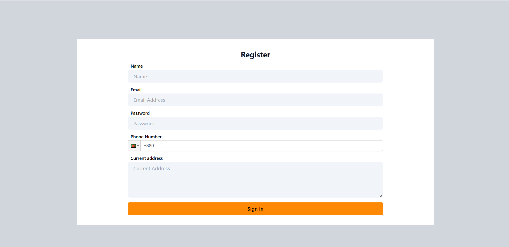

# Self Courier - Frontend

## Navbar - version 1

This version implements the **Navbar** for the **Self Courier** project.

### 🚀 Implemented Features

- **Logo & Branding:** Displays the company logo and name.
- **Navigation Links:** Home, Services, Earn With Us, Help, Language Selection.
- **Dropdown Menus:**
  - **Services:** Parcel Delivery, Same-Day Delivery.
  - **Earn With Us:** Delivery options for Bike, Truck, and Van.
  - **Language Selector:** English and Bangla.
- **Hover-based Dropdowns:** Menus appear when hovering over the respective items.
- **Auto-Close on Mouse Leave:** Dropdowns close when the cursor moves away.
- **Authentication Buttons:** "Login" and "Register" buttons.

### 📌 Navbar Preview 
 
Here is a screenshot of the implemented navbar: 


### Bugs
The `@apply` directive in Tailwind CSS is still not functioning properly.


## Log In page

### Overview
This is a login form. It uses **react-hook-form** for form handling, validation, and submission.

### Features
✅ Email & Password Input Fields  
✅ Terms and Conditions Checkbox  
✅ Real-time Validation with Error Messages  
✅ Background Image on Right Side  
✅ Logo & Brand Name on Top  

### 📌 Usage
This login form requires users to enter their email, password, and agree to the terms & conditions before submitting.

###  Install Dependencies
`react-hook-form`

### 📌 Input Fields & Validation

```ts
type InputFormSignIn = {
  email: string;
  password: string;
  termAndCondition: boolean;
};

```

### 📌 Log In Preview 
 

Here is a screenshot of the implemented Log In: 


## Register Component

This component is a user registration form implemented using React, TypeScript, and `react-hook-form`. It includes form validation, phone number input with country flag (Bangladesh as default), and proper error handling.

### Features

- **Name Input**: Requires a name input.
- **Email Input**: Validates email format and shows error messages for incorrect formats.
- **Password Input**: Enforces strong password rules, including minimum length, letters, numbers, and special characters.
- **Phone Input**: Integrated with `react-phone-input-2` for phone number input, with country flag (Bangladesh as default) and search functionality.
- **Address Input**: Textarea for entering the user’s current address.
- **Form Validation**: Uses `react-hook-form` for managing form state and validation.


###  Install Dependencies
`react-phone-number-2`


Here is a screenshot of the implemented Register:

## User Context and Authentication
This  section covers the `userContext` and `User Authentication Protection Wrapper`.
### Implemented Features
1. **User Context Management**: Manages user authentication and store details
2. **Context provider**: Wraps the application to provide user data globally.
3. **Protected Routes**: Restricts access to authenticated users.
4. **Local Storage Handling**: Stores authentication tokens and user details.
5. **Auto Logout on Invalid Token**: Redirects users to the login page when authentication fails.
### Authentication Flow
1. User login and Auth:
     - A user enters their email and password on the login page.
     - When the user submits the form, a request is sent to the backend authentication API.
     - If authentication is **successful**:
       - The backend responds with `user details` and an authentication `token`.
       - The token and user information are stored in localStorage for session persistence.
       - The user is redirected to the Homepage or the intended page.
     - If authentication **fails**:
       - An error message is displayed, prompting the user to check their credentials.
2. Managing User State with Context
   - The `UserContext` provides a global state for user information.
   - When a user logs in, their details (email, role, name, etc.) are stored in this context.

3. Protected Routes & Access Control


## Hero Section Preview
Here is a screenshot of the implemented Hero Section: 

## Key Features Preview
Here is a screenshot of the implemented key features Section: 

## Why choose Us? 
Here is a screenshot of the implemented Why Choose Us: 
